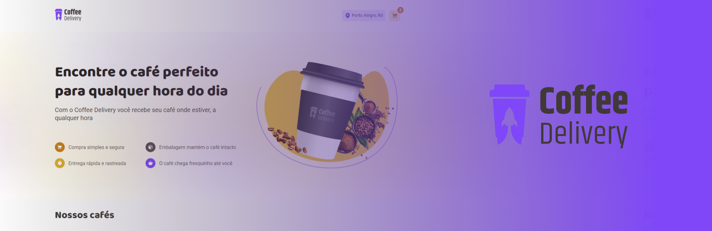

## Projeto Coffee Delivery

Nesse desafio utilizamos ainda mais fundo em funcionalidades do React, e dessa vez adicionando também mais regras para praticar ainda mais o uso do ReactJS.

### 🛠️ Nesse projeto foi utilizado

* Vite
* Styled Components
* Local Storage
* Typescript
* Context API
* React Router Dom
* React Hook Form
* Validações de formulário com Zod

## 🚀 Como executar

**Para que esse projeto funcione corretamente, é preciso estar com o servidor rodando.**

- Instale os pacotes com `npm install ou yarn`.
- Execute `npm run dev ou yarn dev` para iniciar o cliente web.

## 🖼 Imagens do projeto:
